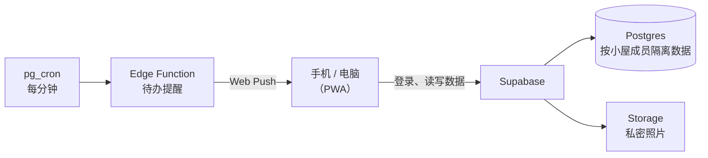

# 情侣小屋

> 给我和女朋友做的私密情侣生活软件，可以像 App 一样装到手机桌面。
>
> 在线地址：https://xxoingr.github.io/xiaojia-house-pages/ （注册需要通行码）

## 为什么做

最开始是看到有博主教普通人给自己做一个"工具台"，我就想给女朋友也做一个。做着做着，想法变成了一个只属于我们两个人的情侣软件：**私密、温馨**。

我也找过市面上的情侣软件，要么收费，要么功能太少、用着不顺手，所以决定自己做。

## 功能

| 模块 | 内容 |
| --- | --- |
| 🏡 我们俩 | 纪念日、时间轴、照片墙、小屋聊天（可发照片） |
| 📌 生活 | 待办（到点推送到手机）、记账、日记、心情 |
| 💪 健康 | 饮食、体重、运动、睡眠、生理期记录 |
| ☁️ 账号与同步 | 邮箱注册登录、邀请码组建两人小屋、双设备云端同步、备份与恢复 |

## 技术栈

| 部分 | 选型 |
| --- | --- |
| 前端 | 原生 HTML / CSS / JavaScript 单页应用，不依赖框架 |
| 安装与离线 | PWA：Web App Manifest + Service Worker（缓存、推送通知） |
| 后端 | [Supabase](https://supabase.com/)：Postgres 数据库、邮箱登录、私密文件存储 |
| 定时提醒 | Supabase Edge Function（Deno / TypeScript），由 `pg_cron` 每分钟调用 |
| 部署 | GitHub Pages，PowerShell 脚本通过 GitHub API 发布 |

## 架构



## 技术要点

- **数据隔离**：所有表都开启了 Postgres 行级安全（RLS）。每次读写数据库都会检查"你是不是这间小屋的成员"，所以两个人只能看到自己小屋的数据。
- **加入小屋**：创建、加入、切换小屋都放在数据库函数里完成（`xj_join_house` 等）。前端只能调用函数，不能直接改成员表。
- **注册保护**：注册时要输入通行码，由数据库函数校验，网页源码里没有这个码。
- **密钥管理**：推送用的私钥和定时任务令牌存放在 Supabase Vault，不出现在代码里。
- **提醒重试**：推送失败时按 5 / 15 / 30 / 60 分钟的间隔重试，最多 5 次；对方手机还没开通知时，只等待、不消耗重试次数（策略测试见 `work/reminder-retry-check.mjs`）。
- **可演进的数据库**：13 个迁移文件记录了每次改动，都是在真实使用中发现问题后修复的。

## 项目结构

```text
index.html                  整个前端（单页应用）
sw.js                       Service Worker：缓存与推送
supabase-config.js          Supabase 地址和可公开的 publishable key
supabase-setup.sql          初始数据库结构、访问规则、小屋函数
supabase-migration-*.sql    后续迁移
supabase-reminders*.sql     待办提醒相关表和定时任务
supabase-functions/         Edge Function：发送待办提醒
upload-github-pages.ps1     发布到 GitHub Pages
SUPABASE-SETUP.md           Supabase 接入说明
```

<!-- TODO: 开发过程 -->
